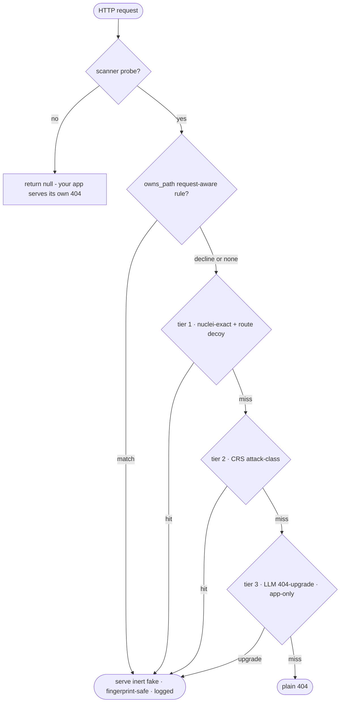

# funnypot-core 🍯

[](LICENSE)
[](composer.json)
[](#how-it-works)
[](https://funnypot.org/packages/funnypot-core/)

> **Not sure you're in the right place?**
> - Want a ready-to-run **honeypot box** to deploy → [funnypot-app](https://github.com/metrictower/funnypot-app)
> - Protecting a **Laravel** app → [funnypot-laravel](https://github.com/metrictower/funnypot-laravel)
> - Protecting a **WordPress** site → [funnypot-wordpress](https://github.com/metrictower/funnypot-wordpress)
> - Detection **and** IP reporting in any PHP app, batteries included → [funnypot](https://github.com/metrictower/funnypot)
> - Embedding the deception/detection **engine** in your own PHP / PSR-15 app → funnypot-core **← you are here**
> - Querying / reporting to the **IP-reputation service** from code (the SDK) → [funnypot-mainnet-client](https://github.com/metrictower/funnypot-mainnet-client)
> - Building on the low-level **decision/policy engine** → [funnypot-policy](https://github.com/metrictower/funnypot-policy)

**The HTTP deception engine behind funnypot.** It answers a scanner's probe with the fake-vulnerable
response the scanner was fishing for. It is the inverse of a [nuclei](https://github.com/projectdiscovery/nuclei)
scan: instead of sending a probe and reading the reply to decide "this host is vulnerable", it reads
an incoming probe and writes the reply that satisfies the scanner's own matcher. The scanner walks
away with a full, coherent, wrong vulnerability report while you log every move.

This is the reusable PHP library. Drop it into any PHP or PSR-15 app and its 404s start answering
scanners with believable decoys. Runtime is pure PHP: no YAML, no extensions, no network. It is inert
by default (detect only); respond mode is opt-in and gated by your own suspicion signal.

> Want to **run** a honeypot, not embed one? The standalone app builds on this package and adds a live
> dashboard, a pure-PHP SSH server, a fake shell, and 18 TCP service emulators:
> **[github.com/metrictower/funnypot-app](https://github.com/metrictower/funnypot-app)**.

## What it does

- **Nuclei inversion.** Compiles the upstream [nuclei-templates](https://github.com/projectdiscovery/nuclei-templates)
  corpus and inverts each detection template into a response that satisfies its matcher. From 11,196
  HTTP templates it indexes about 6,300 invertible ones into roughly 5,100 `(method, path)` route
  personas.
- **Attack-class emulators.** Reflects LFI, SQLi, command injection, SSTI, XXE, shellshock, Struts
  OGNL, open redirect, reflected XSS and cloud-IMDS probes on any path, with canned inert markers
  (`root:x:0:0`, `uid=0(root)`).
- **CRS-broadened coverage.** Recall for the generic attack classes (SQLi/XSS/LFI/RCE) is widened
  from the upstream [OWASP CoreRuleSet](https://github.com/coreruleset/coreruleset): its portable
  PL1 rules are aggregated into one broadened match per class, behind funnypot's SAME response
  archetype. It never invents a per-rule response and never touches the nuclei corpus — see
  [`docs/CRS.md`](docs/CRS.md).
- **Product and route decoys.** Believable `.git/config`, `.env`, `wp-config`, `phpinfo`, `.htpasswd`,
  `server-status`, SSH keys, SQL dumps, phpMyAdmin and more. Data-bearing decoys draw people and records
  from a shared seeded generator (`Support\Fake`, exposed to templates as `{{fake.person.*}}` directives),
  so rows are coherent per deployment rather than repeated `jdoe`/`example.com` placeholders.
- **Anti-fingerprint.** One coherent product persona per attacker (deterministic, spoof-proof seed)
  instead of an impossible "vulnerable to everything" host. Consistent `X-Powered-By`, tamper-evident
  honeytoken cookie whose name, payload vocabulary and attribute tail are seeded per deploy
  (`Honeytoken::bait($deploySeed)`), so the bait envelope is not a fleet-wide regex.
- **AI-API recon surface.** A fake Ollama + OpenAI/Anthropic-shaped model API — `/api/tags`,
  `/api/version`, `/api/ps`, `/api/show`, header-branched `/v1/models` — plus a buffered floor on
  the four chat endpoints. One shared model catalog is the single source of truth for every body.

## Install

```bash
composer require metrictower/funnypot-core
```

## Detect mode (always safe)

Detect never writes to the wire. It just tells you a request is a known scanner probe:

```php
use Funnypot\Core\Honeypot;
use Funnypot\Core\RequestContext;

$funnypot = Honeypot::default();                       // inert: detect-only, gate closed

$detection = $funnypot->detect(RequestContext::fromGlobals());
if ($detection->matched) {
    logScannerProbe($detection->templateIds(), $detection->highestSeverity, $detection->tags());
}
```

## Silencing a noisy template

When one template turns out to be noisy on a particular site, you don't have to switch the sensor
off — you can drop just that template. The id to name is the one you already log:
`Detection::templateIds()` gives the matching ids (and `->tags()` the tags) for a flagged request, so
read a false-positive log line and you have the exact id to silence:

```
/telescope/requests   scanner-probe   ids=laravel-telescope
/robots.txt           ambient         ids=CVE-2023-33960,robots-txt,robots-txt-endpoint,bigcommerce-detect
```

Then list it (or a whole tag) under `ignoreTemplates`:

```php
use Funnypot\Core\Config;
use Funnypot\Core\Honeypot;

$funnypot = Honeypot::default(new Config(
    ignoreTemplates: ['laravel-telescope', 'miscellaneous'],   // ids AND tags accepted
));
```

An ignored template contributes **no evidence** to the classification. A path that matched only
ignored templates classifies `CLEAN`; a path that also matches a non-ignored template is still a
probe on that remaining template (drop-from-evidence). Ids and tags are both accepted, so a whole
noisy tag can go in one entry.

**`ignoreTemplates` is not `exclude`.** They govern opposite sides and never cross over:

| Knob | Governs | Effect |
|---|---|---|
| `ignoreTemplates` | **detection** (`detect()` / `check()`) | the template no longer drives a classification |
| `exclude` | **serving** (`respond()`) | the template's fake is never served, but it still detects |

So `exclude` alone keeps detecting a probe while refusing to serve it a fake; `ignoreTemplates` alone
stops the classification while leaving every other template's serving untouched. Reach for
`ignoreTemplates` when a template is a false positive on your site; reach for `exclude` when you want
the intel but not the decoy.

## Respond mode (opt-in, gated)

```php
use Funnypot\Core\Config;
use Funnypot\Core\Honeypot;
use Funnypot\Core\RequestContext;
use Funnypot\Core\Http\ResponseEmitter;

$funnypot = Honeypot::default(new Config(
    mode: 'respond',
    gate: fn (RequestContext $r) => isSuspicious($r),   // your suspicion predicate; null = closed
    responseStyle: 'realistic',                          // minimal | realistic | taunt
    attackEmulation: true,                               // also reflect LFI/SQLi and friends
));

$response = $funnypot->respond(RequestContext::fromGlobals());
if ($response !== null) {
    ResponseEmitter::emit($response);   // a matched probe gets an inert fake
    exit;
}
// nothing matched: serve your normal 404
```

### Per-deploy persona seed (avoid a fleet-constant identity)

Every fabricated identity — the company name, domain, admin credentials, fake secrets, visual skin — is
a pure function of a per-deploy seed. **If you leave both `deploySeed` and `seedSalt` unset, every
unconfigured install shares one identity**, so a scanner can correlate two of your deploys as "both
funnypot". Set a per-install secret so each site presents a distinct, self-coherent identity:

```php
$secret = /* a per-install secret, generated once and persisted by your app */;
$funnypot = Honeypot::default(new Config(
    mode: 'respond',
    gate: fn ($r) => isSuspicious($r),
    deploySeed: $secret,   // drives the persona IDENTITY ({{persona.*}}, visual skin, decoy session + its breached-DB table story + the bait cookie envelope)
    seedSalt: $secret,     // drives the per-request RENDER seed ({{fake.*}}, {{pick:*}} choices)
));
```

Two independent conditions matter: `deploySeed` (identity material) and `seedSalt` (render salt).
Setting one persisted secret for both is the simplest safe configuration. **The core never generates
or persists the secret** — it does no I/O; provisioning a per-install secret is the host app's job.

The visual skin the `deploySeed` drives is seeded end to end: the CSS class-name prefix **word** (a
neutral `<word>-XXXX` namespace, never the old fleet-constant `fp-`) and the full text **palette**
(including the foreground/muted greys) vary per deploy too (FP-0283), so two deploys never share one
CSS hash. Skins reach the prefix through `RenderHtmlHelpers::bindClassPrefix($persona->classPrefix())`,
called once at the top of `render()`; the widget helpers throw if used unbound (there is no
fleet-constant fallback).

> **Release note (FP-0283 — breaking `RenderHtmlHelpers` trait API).** FP-0283 removes the fixed `fp-`
> class prefix and gives the widget trait a required `bindClassPrefix()`/`chromeClass()`/`widgetCss()`
> surface. This is a **breaking change for `^0.6` consumers**, so the **first core tag that contains
> FP-0283 MUST be `v0.7.0`, never a `v0.6.x`** — a `v0.6.x` tag would let a consumer's `composer update`
> pull the new trait and throw on every panel that renders a widget unbound. The app tier adopts it (bump
> to `^0.7` + bind + rename its own `fp-*` literals) under follow-up **FP-0298**.

The `deploySeed` also drives the **decoy surface graph** (the `/sitemap.xml`, `/robots.txt`, OpenAPI/
Swagger docs and REST index): its advertised endpoint set, ordering and resource nouns are a per-deploy
seeded subset (`{{surface.*}}`), so two deploys expose different but internally-coherent surface graphs
instead of one fleet-correlation tell — every advertised path still resolves and no linked path ever
dangles. Because it is seed-derived, **upgrading the package re-rolls a deploy's surface graph once**
(a returning scanner sees the site's map change), exactly as it re-rolls the persona identity; the seed
derivation itself never changes.

Ask the engine what it sees, without changing a single served byte:

```php
$health = $funnypot->seedHealth();
// ['identity' => 'set'|'empty'|'placeholder', 'render_salt' => 'set'|'empty', 'ok' => bool, 'warnings' => [...]]
```

`seedHealth()` classifies **by the material string only** — it never inspects the derived seed and never
re-derives, so an unconfigured deploy keeps serving byte-for-byte what it served before; the report is a
non-served diagnostic. An Observer that also implements `HealthObserver` receives the same report once at
construction (push); most hosts read `seedHealth()` on a status page (pull).

### Embedded vs. isolated origin (reflecting decoys)

A few decoys are believable only if they **reflect the attacker's own request bytes** into an active
response context — the reflected-XSS decoy echoes the payload into an HTML body, the open-redirect
decoy echoes the target into a `Location`, and the Vite `/@fs/` decoy echoes the path into its body.
On a **standalone** honeypot that owns its origin, that is safe bait. Embedded **inline in a
response-owning host** (via `funnypot-laravel` or the `funnypot` embedder), the same reflection would
be a live XSS / open redirect in that host's real origin.

The engine is **fail-safe by default**: `Config::$isolatedOrigin` defaults to `false`, meaning "treat
this install as embedded" — reflecting decoys are **withheld from serving**, while detection is
untouched (the probe still classifies, so the intel is captured; only the reflection is suppressed).
A standalone honeypot opts in to keep the bait:

```php
$funnypot = Honeypot::default(new Config(
    mode: 'respond',
    gate: fn (RequestContext $r) => isSuspicious($r),
    attackEmulation: true,
    isolatedOrigin: true,   // this box owns its origin — reflecting decoys are safe bait
));
```

Embedded hosts (`funnypot-laravel`, the `funnypot` embedder) inherit the safe default and need no
change. A template joins this class by declaring `reflects_input: true` at its top level (the attack
and param compilers carry the flag into the compiled rule; the runtime reads it as data), so covering
a future reflector is a one-line template edit with no engine change.

Each reflector also declares an explicit **reflect class** — `reflect_class: xss` (reflected-XSS),
`open-redirect`, or `fs-read` (the Vite `/@fs/` path echo). `Config::$reflectClasses` is a per-class
override map (`array<string, bool>`, default `[]`) that lets an **isolated-origin** honeypot turn a
single class off without disabling the others:

```php
$funnypot = Honeypot::default(new Config(
    mode: 'respond',
    attackEmulation: true,
    isolatedOrigin: true,                    // this box owns its origin
    reflectClasses: ['xss' => false],        // ... but keep reflected-XSS bait off
));
```

A **missing** key defaults to enabled, so the default `[]` reflects every class exactly as before.
The map **AND-composes** with `isolatedOrigin` (`serveReflector(class) = isolatedOrigin && (reflectClasses[class] ?? true)`)
and can therefore only ever **subtract**: setting a class to `true` on an embedded host
(`isolatedOrigin=false`) does **not** re-enable it — the `isolatedOrigin` term dominates, so an
embedded host never reflects, whatever the map says. The fail-safe default is preserved.

### The XSS reflection baseline (inert by charset, not by the gate)

Most XSS scanners (dalfox, nuclei) send a **benign alphanumeric marker** first and only escalate to
markup once it echoes; the gated reflected-XSS decoy above matches markup **only**, so its bait was
unreachable by the very scanners it targets. The `attack-xss-baseline` rule closes that gap: it owns
one synthetic search path, `GET /products/quick-search`, and echoes one query value — `q` — that is
**wholly `[A-Za-z0-9]{1,64}`**. That character class **is** the whitelist: any out-of-class byte
(markup, quotes, `%`-encoding, space, `+`, `&`, CR/LF/NUL, multibyte) makes the capture fail, so the
rule declines and echoes nothing — the reflected string can never carry a markup-forming byte. Unlike
the reflectors above it is therefore **inert by construction** (like the php-cgi source-disclosure
and SSTI-numeric decoys) and serves on a **default embedded install**, with no isolated origin
required. Full-tag reflection stays on the gated `attack-xss` decoy, unchanged.

- **Opt-out is ID-only** for this attack-tier rule: `Config::$exclude = ['attack-xss-baseline']`.
  A **tag** (`exclude: ['xss']`) does **not** disable it — tag-based exclusion applies only to route
  bundles, never the attack tier.
- **Embedding caveat:** on a store miss the attack tier does not consult your `SiteProfile`, and the
  middleware runs before your handler, so if your app genuinely serves `/products/quick-search?q=…`
  the decoy will answer it. This is the same exposure the `/@fs/` and `/catalog/{slug}` decoys accept;
  use the ID opt-out above if the path collides with a real route. (Follow-up: consult the profile in
  the attack tier for store-miss paths.)

### Using Laravel?

Use **[funnypot-laravel](https://github.com/metrictower/funnypot-laravel)**
(`composer require metrictower/funnypot-laravel`) — the ServiceProvider + middleware drop-in. This
repo is the framework-agnostic engine.

### Any other framework (PSR-15)

Wire the engine directly. A PSR-15 middleware (`Funnypot\Core\Http\HoneypotMiddleware`) sends matched
probes an inert fake and passes everything else through, so your app serves its own 404 on a miss.
Start detect-only, watch the logs, then set `mode = respond` and supply a `gate`.

Want detection **and** IP reporting without assembling it yourself?
**[metrictower/funnypot](https://github.com/metrictower/funnypot)** wires this engine to the mainnet
reporting SDK and enforces the request-path invariants for you.

## Response styles

Set at init with `responseStyle`:

| Style | What the attacker gets |
|---|---|
| `minimal` | Just the tokens the matcher needs. Smallest. |
| `realistic` | A believable fake: a full `.git/config`, a plausible `.env`, a real XML-RPC `methodResponse`. All values inert. **The default.** |
| `taunt` | Still satisfies the scanner, and carries a visible "honeypot, your scan was logged" marker. |

Rich content is validated against the matcher before use. If a richer body would not satisfy the
scanner it falls back to minimal, so richness can never break the guarantee.

## How it works



Templates are compiled once, at build time, into frozen PHP arrays (`resources/compiled/*.php`). The
app loads them into opcache and serves with a single O(1) lookup. A miss returns `null` so your app
serves its own 404. `symfony/yaml` is only needed by the compiler (`bin/funnypot compile`), which CI
runs weekly against the latest nuclei-templates release. See [`SPEC.md`](SPEC.md) and
[`docs/PERSONA-CAP.md`](docs/PERSONA-CAP.md).

## Memory and opcache

**opcache is an operating requirement, not an optimisation.** The compiled index is a pure literal
PHP array, which is what lets opcache intern it into shared memory as an immutable array — shared
across workers at no per-process cost. Turn opcache off and the index is re-materialised on **every
request**.

Measured on the shipped artifact (6,397 templates / 5,196 routes), identical on PHP 7.3, 8.0, 8.4
and 8.5:

| | opcache **on** | opcache **off** |
|---|---|---|
| process heap, per request | **0.00 MB** | 20.43 MB |
| private memory, per worker | **~0.9 MB** | ~42 MB |
| shared memory, once per host | ~14 MB | — |
| `Honeypot::default()` + `detect()` | **0.2 ms** | 52 ms |

Warm `detect()` is 2–20 µs. A pool of 20 workers costs roughly **35 MB total** with opcache and
~840 MB without.

What to check when embedding:

- `opcache.enable=1`; also `opcache.enable_cli=1` if you construct the engine from CLI or queue
  workers — CLI opcache is off by default, so a worker that touches `Honeypot::default()` pays the
  full cost on every process boot
- at least ~20 MB of opcache shared memory free above whatever your app already uses, and
  `opcache.max_accelerated_files` above your app's file count
- never `opcache.file_cache_only=1` — it loads into process memory and silently reinstates the full
  cost
- **bind `Honeypot::default()` lazily.** An eager service-provider binding makes every CLI and queue
  process pay for an index it will never consult.

Check a host with the bundled command — exit 0 when the index is shared, 1 when it is not, so a
deploy step can gate on it:

```bash
php vendor/metrictower/funnypot-core/bin/funnypot doctor
```

```
index shared : yes
reason       : interned into opcache shared memory
sapi         : cli
opcache free : 238.5 MB
```

Run it from the SAPI that actually serves your traffic. `PhpArrayStore::diagnose()` returns the same
verdict as an array if you would rather wire it into a health endpoint; it never throws, and it
degrades to `shared => false` when `opcache.restrict_api` blocks the introspection calls.

Two ways to lose the interning silently: `file_cache_only` as above, and making the compiled
artifact non-literal (a `const` reference, a function call, a computed key). Both are worth catching
in review.

Note a one-shot CLI process can never show the benefit — it is a guaranteed cold cache, so measuring
there reports the opcache-off numbers no matter how opcache is configured.

### Response precedence

`respond()` decides what to serve in a fixed order — an earlier tier always wins:

1. **Nuclei-exact (tier 1).** The request routes to a compiled nuclei template or route decoy →
   a byte-exact response derived from what that scanner probes for.
2. **CRS-generic / attack-class (tier 2).** No route matched → `TemplateAttackEmulator` emulates a
   generic attack class (hand-authored rules first, then the CRS-broadened alternation) from a
   hand-authored response archetype.
3. **LLM fake, then plain 404 (tiers 3–4, app layer).**

So a request matching BOTH a nuclei template AND a CRS attack class always gets the nuclei-exact
response — **nuclei-exact beats CRS-generic**. CRS is a coverage multiplier for tier 2, never a
tier-1 source. Full detail, and how to regenerate (`bin/funnypot compile-crs`), in
[`docs/CRS.md`](docs/CRS.md).

**Path ownership override.** A request-blind tier-1 decoy is the *right* answer for most paths, but a
few paths deserve a request-*aware* emulator that dispatches on the request body — a WordPress
`xmlrpc.php` that parses the `methodCall`, a panel login that answers a brute-force attempt. Such a
rule declares `owns_path:` in its template; for those paths the request-aware attack tier is consulted
**before** the static tier-1 entry, and a match wins. Critically, a rule *decline* falls straight
through to the static decoy — so ownership only ever *upgrades* a served path, never removes coverage,
and it sits after the "never shadow a live host route" guard so a real endpoint is untouched. This is
how bare `/xmlrpc.php` and the credential oracles serve request-aware responses even though a static
decoy also keys those paths.

### AI-API recon surface

The same owns_path override backs a fake AI-inference API: Ollama `/api/tags`, `/api/version`,
`/api/ps`, and a per-model `/api/show` (POST), plus a header-branched `GET /v1/models` — no
`anthropic-version` header gets the OpenAI list shape, its presence switches to the Anthropic shape.
A buffered ("non-streaming") floor answers the four chat paths (`/api/chat`, `/api/generate`,
`/v1/chat/completions`, `/v1/messages`) with a static, deliberately-wrong answer and the request's
own model echoed back; the echo is capture-bounded so a malformed model value can never break the
served JSON. `/api/tags` and `/api/ps` also carry a heavy-weighted tier-1 route decoy, so the AI
persona still wins the rare corpus-template collision even where owns_path isn't in play.

Every body is `json_encode()` of a projection from `resources/ai/model-catalog.php`, read through
`Funnypot\Core\Ai\ModelCatalog` — one source of truth for both the route- and attack-tier copies, so
there's nothing to hand-sync. The catalog leads with `mythos` (owned_by anthropic), the box's fictional
house flagship — placed first so it heads `/v1/models` + `/api/tags` and shows as the loaded model on
`/api/ps`, matching the identity the chat surface gives when asked "what model are you"; the real,
verified models follow as the also-available multi-model rig. `bin/funnypot compile-ai` regenerates the templates from the catalog
(route templates into `templates/generated/`, owns_path rules into `templates/attack-ai/`); re-run
it after a catalog change, then rebuild the in-repo artifacts with `composer build` — the single
`funnypot build` orchestrator that encodes the whole DAG in order (`compile-ai` → `compile-emulators`
→ `compile-routes` → `compile-params` → `merge-routes` → `build-manifest`; `merge-routes` is
idempotent by pid, so re-folding never duplicates a route). A full rebuild from the external corpus
starts from a base `compile` first, then `composer build`.

The interactive streaming chat and the actual LLM live in the funnypot **app**, not here — this
package only floors the buffered, non-streaming chat shapes, so those four paths still answer
believably when the app's LLM is off.

## Handmade decoys

The **hand-authored** decoys — original responses re-derived from what a scanner probes for (never
vendored upstream markup). Distinct from the auto-inverted nuclei-templates corpus, which is generated
at build time and not listed here. Every response stays **inert** (emulates output, never executes) and
**fingerprint-safe** (never echoes a scanner's own signature strings).

| Family | Decoys | Behaviour |
|---|---|---|
| **Panel login oracles** | Grafana · Kibana · Jenkins · Webmin · cPanel/cpsrvd · phpPgAdmin · WP-login · D-Link HNAP | Byte-faithful login pages that **never** authenticate — bait the login, log the attempt, always decline |
| **Mock-auth (high-interaction)** | phpMyAdmin (gate + login + authed dashboard) · WordPress (wp-login mint → authed `/wp-admin` dashboard) | Accepts any credential → inert decoy session → an authed decoy: phpMyAdmin's "breached DB" (6 seeded tables, one seeded with an inert CTF-style flag) or a full WordPress admin dashboard. Dormant until a signing key is set |
| **WordPress** | xmlrpc (base · GET · addtwo · `system.multicall`) · wp-login (mock-auth mint) · wp-admin (authed dashboard, else login redirect) · REST API (`/wp-json` index + `wp/v2` users · posts · pages · comments · media · categories · tags · types · statuses · settings) | Request-aware `xmlrpc.php` parses the `methodCall`; a plausible wp-login POST mints a signed decoy session and 302s to `/wp-admin/`, which renders an authed admin dashboard for that cookie and falls back to the pinned login redirect otherwise; REST endpoints serve one persona-seeded author set (5 users, index 1 = admin) that every collection references — no email/login exposed to anon, `settings` → 401 |
| **Next.js / RSC** | App-Router `GET /` shell + a React Server Components (Flight) responder for `?_rsc=` navigations | A persona-gated framework fingerprint for the 2025 RSC CVE family (CVE-2025-55182/-55183/-55184) — fires only on deploys where the persona lottery picked Next.js for `/`, so it never leaks a stray Flight response on a WordPress/nginx deploy. Inert hand-authored Flight document, no request byte reflected |
| **RCE / CVE exploits** | Confluence OGNL (26134) · php-cgi (1823 · 4577) · Shellshock · Struts OGNL (5638) · PHPUnit (9841) · ThinkPHP · F5 iControl (1388) · GeoServer (36401) · Laravel Ignition · ownCloud (49103) · Spring Actuator · webshell | Fake-vulnerable responses so the scanner "confirms" a hit that isn't real |
| **IoT / edge exploits (CVE)** | Hikvision camera (36260) · GPON router (10561) · Fiberhome router (27973) · Netgear router (6277) · Xdebug remote-debug recon · Node-RED (deploy RCE + recon) | Signal-only decoys for the highest-volume real-world IoT/edge HTTP exploit probes — path/payload-gated, inert canned reply, no request byte reflected |
| **Injection & reflection** | SQLi · XSS · SSTI (Twig · numeric) · command injection (unix · windows) · XXE · open-redirect · CRLF response-splitting · php-glastopf | Plausible reflected-payload behaviour, never executed |
| **LFI / traversal** | `/etc/shadow` · `/etc/group` · `/proc/*/environ` · unix · windows · SMB conf | Bounded fake file-read, in-string only — no filesystem access |
| **Network appliances (CVE)** | FortiOS (40684) · Ivanti Connect Secure (21887) · Citrix Bleed (4966) | Edge-device exploit surfaces bots sweep hardest |
| **Cloud / IMDS** | EC2 instance-metadata tree (category listing · every leaf · `placement`/`iam`/`network`/`block-device-mapping` sub-listings) · `instance-identity/document` · `iam/security-credentials` role listing → inert STS creds | Fully-walkable SSRF/LFI bait — every advertised child resolves (no partial tell), all values inert, seed-coherent, and consistent across the document and leaves |
| **AI-API impersonation** | Ollama (`/api/tags` · `version` · `ps` · `show` · `chat` · `generate`) · OpenAI chat · Anthropic messages · `GET /v1/models` | Byte-exact inference-API surfaces to bait LLM/GPU scanners; buffered troll-chat floor |
| **CRS attack-class engine** | sqli · xss · lfi · rce | A coverage multiplier for tier 2 — broadens the generic attack-class alternation |
| **Static file & config leaks** *(route tier)* | config & secret files, cloud/AWS creds, `.env`, logs, API docs / Swagger, VCS metadata (`.git` HEAD/logs/packed-refs/refs, `.svn`, `.hg`, `.bzr`, `CVS/Entries` — coherent shas/refs/branch), CMS configs (TYPO3 `typo3conf/` + `localconf.php`), backups, `phpinfo`, directory listings | The long tail scanners crawl for — served as plausible disclosure pages |

> A generated visual of this inventory + the response-precedence pipeline lives at `docs/DECOY-MAP.md`
> (auto-generated by `bin/funnypot map` — planned; see the roadmap).

## Runtime rule updates (no composer update)

Rules move roughly weekly (nuclei-templates tags, CRS releases). Instead of a `composer update`
per change, a honeypot can fetch **signed** rule releases at runtime and hot-swap them:

```bash
funnypot rules:update  --data-dir=/var/lib/funnypot/rules   # fetch, verify, atomic swap
funnypot rules:status  --data-dir=/var/lib/funnypot/rules
funnypot rules:rollback --data-dir=/var/lib/funnypot/rules  # network-free, to a retained release
```

On Laravel, [funnypot-laravel](https://github.com/metrictower/funnypot-laravel) ships the scheduled
command; core itself is framework-free. With no
`data_dir` configured, nothing changes — the engine loads only the bundled artifacts, exactly as
before. Because the compiled artifacts are `require`d PHP, an update is verified in depth before
anything is loaded: an **ed25519 signature** against a public key vendored *inside this package*
(never fetched), a per-file **sha256** cross-check, a **pure-array-literal** proof of every `.php`
(no code can execute on load), a **ReDoS** budget on every regex, a fingerprint-leak re-scan, and
an **anti-blinding** coverage floor. Any failure keeps the current rules — the honeypot never
serves empty. Full mechanism, trust model, and operator runbook:
[`docs/RULES-UPDATE.md`](docs/RULES-UPDATE.md).

## Safety

funnypot can only mislead an attacker, never help one.

- **Emulate output, never execute input.** No `exec` / `eval`, no real filesystem, no outbound socket.
- **Reflect, never harm.** No bombs, no retaliation, no outbound requests. All responses size-capped
  (`maxBodyBytes`, default 64 KB).
- **Never reflects attacker input**, never deserializes a request body. Every synthesized header is
  CRLF/NUL-safe.
- **Inert by default.** A fresh install is detect-only with the gate closed. A layered gate then
  guards respond mode: kill switch, mode, trusted bypass, suspicion gate, severity ceiling, coherent
  persona, body-size cap.
- **Inert fakes only.** `example.com` hosts, RFC-5737 IPs, obviously-fake keys. Never a real secret.
- **Credential oracles never authenticate.** Login endpoints (Webmin, Jenkins, HNAP, and the panel
  logins) answer a brute-force attempt with the real "login failed" — captured only to gate the
  response, never reflected — and have **no success path**: no authenticated session, no auth cookie,
  no code path that could accept a password. Adversarially proven zero-exec.

## Testing

```bash
composer install
vendor/bin/phpunit                 # unit + compiler suite
bash tests/acceptance/run.sh       # real nuclei (Docker) vs a php -S server (golden test)
```

### Zero-drift compiled-artifact law

The compiled artifacts under `resources/compiled/` are generated from the templates and MUST be
regenerated-and-committed whenever the templates change — nothing serves them stale, but a stale
`funnypot-manifest.php` / orphaned `manifest.json` fingerprint is a real defect. Two commands:

```bash
composer build                     # recompile the in-repo artifacts (the funnypot build DAG)
composer check                     # the LAW: recompile + drift gate + lint-routes + fingerprint + namespace
```

Run `composer check` before pushing. It runs the exact bytes CI's `artifact-law` workflow runs
(both call `scripts/ci/check-drift.sh`), so local and CI cannot disagree: the script rebuilds, then
`git status --porcelain` over `resources/compiled` + `templates/generated` + `templates/attack-ai`
must be empty (catching modified, untracked, and deleted outputs — a plain `git diff` misses new
files), and `manifest.json`'s sha256 must fingerprint `nuclei-index.full.php`. If it drifts, run
`composer build` and commit the result.

**How the compile is made deterministic.** The compiled index carries no wall-clock stamp — the old
`built_at` field made a fresh recompile never reproduce the committed bytes, so it moved to the JSON
sidecars (`manifest.json` / `crs-manifest.json`), which are refresh-workflow records, never rewritten
by the in-repo `build`. In its place each artifact carries a reproducible `source-tree` sha256
provenance stamp (`SourceTreeStamp` over exactly the `*.yaml` set the step globbed, repo-relative and
`SORT_STRING`-ordered), and the index keeps `upstream_tag`/`upstream_sha` for the pinned corpus. File
globs sort `SORT_STRING` (cross-PHP-stable for the digit-prefixed filenames) and all compile writes go
through one atomic writer. `merge-routes` owns the index's reproducible fields: it recomputes
`source_tree`, refreshes the post-fold `route_keys`/`templates_indexed` counts (which
`RulesUpdater`/`publish-rules-release` read into coverage and signed release manifests), and refreshes
the `manifest.json` sha256/size so the sidecar's fingerprint actually verifies the index.

The law is defined at **PHP 8.3's bytes** (the version the refresh workflows build with). Line
endings are pinned to **LF** via `.gitattributes` (`*.yaml`/`*.php text eol=lf`) so a CRLF checkout
can't change a content hash and make local `composer check` disagree with CI. `artifact-law` ships as
`workflow_dispatch`-only for now (FP-0039's PR-CI pause stands); the law is enforced by `composer
check` locally and manual dispatch.

`compile-emulators` prints ~23 exit-0 `warning:` lines about the AI `owns_path` templates on a clean
build — an intentional design note (those rules lean on the runtime auth-witness backstop, not full
path-regex variant coverage), **not** drift. Only a non-zero exit or a dirty tree is drift.

## Licence

MIT, see [LICENSE](LICENSE). Derived in part from
[projectdiscovery/nuclei-templates](https://github.com/projectdiscovery/nuclei-templates)
(MIT, © 2025 ProjectDiscovery, Inc.); the upstream notice is kept at
[`resources/UPSTREAM-LICENSE.md`](resources/UPSTREAM-LICENSE.md). The CRS-broadened attack
templates are derived from [OWASP CoreRuleSet](https://github.com/coreruleset/coreruleset)
(Apache-2.0); its separate notice and statement of changes are at
[`resources/UPSTREAM-LICENSE-CRS.md`](resources/UPSTREAM-LICENSE-CRS.md). A CI license gate
(`scripts/ci/check-license.sh`, SPDX allow-list) enforces this on every upstream refresh.
