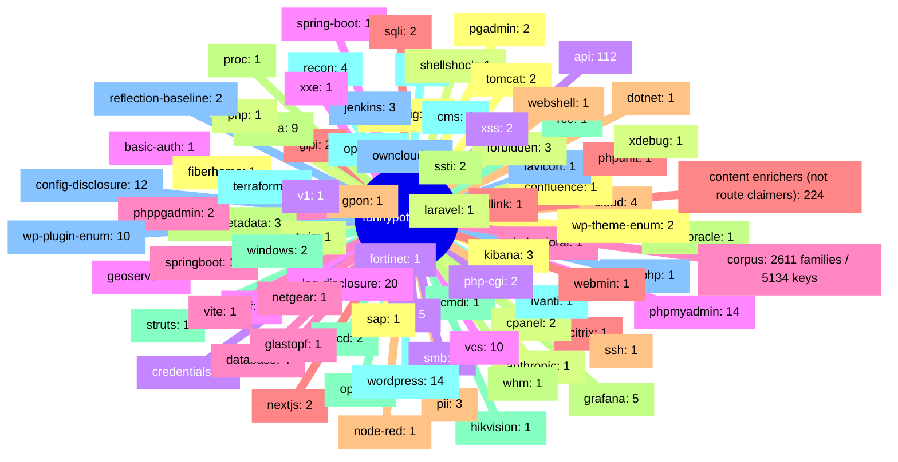

# Decoy map

> GENERATED by `bin/funnypot map` from `resources/compiled/funnypot-manifest.php` — DO NOT EDIT.
> The manifest is the sole inventory authority; friendly names, categories and behavior
> prose live in the README taxonomy, not here.

Manifest schema 1. Authored records: 344 across 81 families. Corpus: 2611 families / 5134 route keys (summarized, not enumerated). Enrichers: 224.

| Family | Authored records | Tier mix | Owned routes | Outbound links | Max severity | Integrity |
|---|---|---|---|---|---|---|
| ai-config | 12 | new-page:12 | 12 | 0 | high | &mdash; |
| anthropic | 1 | attack-ai:1 | 1 | 0 | medium | &mdash; |
| api | 112 | new-page:112 | 112 | 0 | info | &mdash; |
| basic-auth | 1 | new-page:1 | 1 | 0 | low | &mdash; |
| behavioral | 1 | param:1 | 1 | 0 | high | &mdash; |
| citrix | 1 | attack:1 | 0 | 0 | critical | &mdash; |
| cloud | 4 | new-page:4 | 4 | 0 | high | &mdash; |
| cloud-metadata | 3 | attack:3 | 1 | 0 | high | &mdash; |
| cmdi | 1 | attack:1 | 0 | 0 | critical | &mdash; |
| cms | 4 | new-page:4 | 4 | 0 | high | &mdash; |
| config-disclosure | 12 | new-page:12 | 12 | 0 | high | &mdash; |
| confluence | 1 | attack:1 | 0 | 0 | critical | &mdash; |
| cpanel | 2 | attack:1 new-page:1 | 2 | 2 | high | accepted, info |
| credentials | 3 | new-page:3 | 3 | 0 | high | &mdash; |
| crlf | 1 | attack:1 | 0 | 0 | low | &mdash; |
| database | 4 | new-page:4 | 4 | 0 | high | &mdash; |
| dlink | 1 | attack:1 | 1 | 0 | high | &mdash; |
| dotnet | 1 | new-page:1 | 1 | 0 | medium | &mdash; |
| error-oracle | 1 | attack:1 | 0 | 0 | medium | &mdash; |
| etcd | 2 | attack:2 | 3 | 0 | high | info |
| f5 | 1 | attack:1 | 0 | 0 | critical | &mdash; |
| favicon | 1 | new-page:1 | 1 | 0 | info | &mdash; |
| fiberhome | 1 | attack:1 | 1 | 1 | critical | warn |
| forbidden | 3 | new-page:3 | 3 | 0 | info | &mdash; |
| fortinet | 1 | attack:1 | 0 | 0 | critical | &mdash; |
| geoserver | 1 | attack:1 | 0 | 0 | critical | &mdash; |
| glastopf | 1 | attack:1 | 0 | 0 | critical | &mdash; |
| glpi | 2 | new-page:2 | 2 | 0 | high | &mdash; |
| gpon | 1 | attack:1 | 1 | 0 | critical | &mdash; |
| grafana | 5 | attack:1 new-page:4 | 5 | 0 | high | info |
| hikvision | 1 | attack:1 | 1 | 0 | critical | &mdash; |
| ivanti | 1 | attack:1 | 0 | 0 | critical | &mdash; |
| jenkins | 3 | attack:1 new-page:2 | 3 | 1 | high | accepted |
| kibana | 3 | attack:1 new-page:2 | 3 | 0 | high | info |
| laravel | 1 | attack:1 | 1 | 0 | high | &mdash; |
| lfi | 5 | attack:4 attack-crs:1 | 0 | 0 | high | &mdash; |
| log-disclosure | 20 | new-page:20 | 20 | 0 | high | &mdash; |
| netgear | 1 | attack:1 | 1 | 0 | critical | &mdash; |
| nextjs | 2 | attack:1 new-page:1 | 2 | 0 | high | accepted, info |
| node-red | 1 | attack:1 | 0 | 0 | critical | &mdash; |
| ollama | 9 | attack-ai:6 new-page:3 | 9 | 0 | medium | info |
| open | 1 | attack:1 | 0 | 0 | medium | &mdash; |
| openai | 1 | attack-ai:1 | 1 | 0 | medium | &mdash; |
| owncloud | 1 | attack:1 | 0 | 0 | high | &mdash; |
| pgadmin | 2 | new-page:2 | 2 | 0 | info | &mdash; |
| php | 1 | new-page:1 | 1 | 0 | high | &mdash; |
| php-cgi | 2 | attack:2 | 0 | 0 | critical | &mdash; |
| phpmyadmin | 14 | attack:2 new-page:12 | 22 | 2 | high | accepted, info |
| phppgadmin | 2 | attack:1 new-page:1 | 2 | 1 | high | &mdash; |
| phpunit | 1 | attack:1 | 0 | 0 | critical | &mdash; |
| pii | 3 | new-page:3 | 3 | 0 | medium | &mdash; |
| proc | 1 | attack:1 | 0 | 0 | high | &mdash; |
| rce | 1 | attack-crs:1 | 0 | 0 | critical | &mdash; |
| recon | 4 | attack:1 new-page:3 | 4 | 0 | medium | &mdash; |
| reflection-baseline | 2 | attack:2 | 2 | 2 | medium | accepted |
| sap | 1 | new-page:1 | 1 | 0 | medium | &mdash; |
| shellshock | 1 | attack:1 | 0 | 0 | critical | &mdash; |
| smb | 1 | attack:1 | 0 | 0 | high | &mdash; |
| spring-boot | 1 | attack:1 | 0 | 0 | high | &mdash; |
| springboot | 12 | new-page:12 | 12 | 0 | high | &mdash; |
| sqli | 2 | attack:1 attack-crs:1 | 0 | 0 | high | &mdash; |
| ssh | 1 | attack:1 | 0 | 0 | high | &mdash; |
| ssti | 2 | attack:2 | 0 | 0 | high | &mdash; |
| struts | 1 | attack:1 | 0 | 0 | critical | &mdash; |
| terraform | 3 | new-page:3 | 3 | 0 | high | &mdash; |
| thinkphp | 1 | attack:1 | 0 | 0 | critical | &mdash; |
| tomcat | 2 | new-page:2 | 2 | 0 | medium | &mdash; |
| twig | 1 | attack:1 | 0 | 0 | high | &mdash; |
| v1 | 1 | attack-ai:1 | 1 | 0 | medium | info |
| vcs | 10 | new-page:10 | 10 | 0 | medium | &mdash; |
| vite | 1 | param:1 | 1 | 0 | high | &mdash; |
| webmin | 1 | attack:1 | 1 | 2 | high | accepted |
| webshell | 1 | attack:1 | 0 | 0 | critical | &mdash; |
| whm | 1 | new-page:1 | 1 | 0 | low | &mdash; |
| windows | 2 | attack:2 | 0 | 0 | critical | &mdash; |
| wordpress | 14 | attack:14 | 18 | 4 | critical | accepted, info |
| wp-plugin-enum | 10 | new-page:10 | 10 | 0 | medium | &mdash; |
| wp-theme-enum | 2 | new-page:2 | 2 | 0 | medium | &mdash; |
| xdebug | 1 | attack:1 | 0 | 0 | critical | &mdash; |
| xss | 2 | attack:1 attack-crs:1 | 0 | 0 | high | &mdash; |
| xxe | 1 | attack:1 | 0 | 0 | high | &mdash; |
| _corpus (nuclei-inversion)_ | 2611 families / 5134 keys | &mdash; | &mdash; | &mdash; | &mdash; | &mdash; |
| _content enrichers (not route claimers)_ | 224 | &mdash; | &mdash; | &mdash; | &mdash; | &mdash; |

Per-family detail: `bin/funnypot map --family=NAME --format=md` (or `--format=mermaid` for the raw flowchart).
