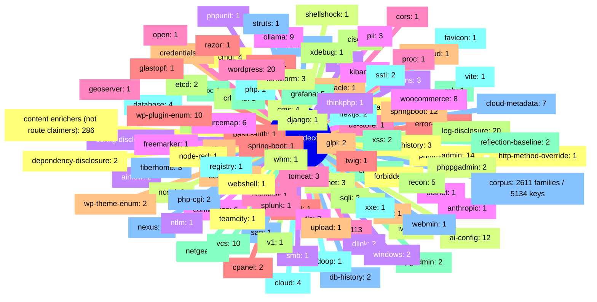

# Decoy map

> GENERATED by `bin/funnypot map` from `resources/compiled/funnypot-manifest.php` — DO NOT EDIT.
> The manifest is the sole inventory authority; friendly names, categories and behavior
> prose live in the README taxonomy, not here.

Manifest schema 1. Authored records: 426 across 109 families. Corpus: 2611 families / 5134 route keys (summarized, not enumerated). Enrichers: 286.

```mermaid
mindmap
  root((funnypot decoys))
    fam0001["2fa: 1"]
    fam0002["ai-config: 12"]
    fam0003["airflow: 2"]
    fam0004["anthropic: 1"]
    fam0005["api: 113"]
    fam0006["basic-auth: 1"]
    fam0007["behavioral: 1"]
    fam0008["cisco: 1"]
    fam0009["citrix: 1"]
    fam0010["cloud: 4"]
    fam0011["cloud-metadata: 7"]
    fam0012["cmdi: 4"]
    fam0013["cms: 4"]
    fam0014["config-disclosure: 13"]
    fam0015["confluence: 6"]
    fam0016["cors: 1"]
    fam0017["cpanel: 2"]
    fam0018["credentials: 3"]
    fam0019["crlf: 1"]
    fam0020["crushftp: 1"]
    fam0021["database: 4"]
    fam0022["db-history: 2"]
    fam0023["dependency-disclosure: 2"]
    fam0024["django: 1"]
    fam0025["dlink: 2"]
    fam0026["dotnet: 1"]
    fam0027["ds-store: 1"]
    fam0028["error-based: 2"]
    fam0029["error-oracle: 1"]
    fam0030["etcd: 2"]
    fam0031["f5: 1"]
    fam0032["favicon: 1"]
    fam0033["fiberhome: 3"]
    fam0034["forbidden: 3"]
    fam0035["fortinet: 3"]
    fam0036["fpd: 3"]
    fam0037["freemarker: 1"]
    fam0038["geoserver: 1"]
    fam0039["glastopf: 1"]
    fam0040["glpi: 2"]
    fam0041["gpon: 1"]
    fam0042["grafana: 5"]
    fam0043["hadoop: 1"]
    fam0044["hikvision: 2"]
    fam0045["http-method-override: 1"]
    fam0046["ivanti: 1"]
    fam0047["jenkins: 3"]
    fam0048["kibana: 3"]
    fam0049["langflow: 1"]
    fam0050["laravel: 1"]
    fam0051["lfi: 5"]
    fam0052["log-disclosure: 20"]
    fam0053["netgear: 1"]
    fam0054["nextjs: 2"]
    fam0055["nexus: 2"]
    fam0056["node-red: 1"]
    fam0057["nosql: 2"]
    fam0058["ntlm: 1"]
    fam0059["ollama: 9"]
    fam0060["open: 1"]
    fam0061["openai: 1"]
    fam0062["owncloud: 1"]
    fam0063["palo-alto: 4"]
    fam0064["pgadmin: 2"]
    fam0065["php: 1"]
    fam0066["php-cgi: 2"]
    fam0067["phpmyadmin: 14"]
    fam0068["phppgadmin: 2"]
    fam0069["phpunit: 1"]
    fam0070["pii: 3"]
    fam0071["proc: 1"]
    fam0072["razor: 1"]
    fam0073["rce: 1"]
    fam0074["recon: 5"]
    fam0075["reflection-baseline: 2"]
    fam0076["registry: 1"]
    fam0077["sap: 1"]
    fam0078["shell-history: 3"]
    fam0079["shellshock: 1"]
    fam0080["smb: 1"]
    fam0081["sourcemap: 6"]
    fam0082["splunk: 1"]
    fam0083["spring-boot: 1"]
    fam0084["springboot: 12"]
    fam0085["sqli: 2"]
    fam0086["ssh: 1"]
    fam0087["ssti: 2"]
    fam0088["struts: 1"]
    fam0089["teamcity: 1"]
    fam0090["terraform: 3"]
    fam0091["thinkphp: 1"]
    fam0092["tls: 2"]
    fam0093["tomcat: 3"]
    fam0094["twig: 1"]
    fam0095["upload: 1"]
    fam0096["v1: 1"]
    fam0097["vcs: 10"]
    fam0098["vite: 1"]
    fam0099["webmin: 1"]
    fam0100["webshell: 1"]
    fam0101["whm: 1"]
    fam0102["windows: 2"]
    fam0103["woocommerce: 8"]
    fam0104["wordpress: 20"]
    fam0105["wp-plugin-enum: 10"]
    fam0106["wp-theme-enum: 2"]
    fam0107["xdebug: 1"]
    fam0108["xss: 2"]
    fam0109["xxe: 1"]
    corpus["corpus: 2611 families / 5134 keys"]
    enrichers["content enrichers #40;not route claimers#41;: 286"]
```

| Family | Authored records | Tier mix | Owned routes | Outbound links | Max severity | Integrity |
|---|---|---|---|---|---|---|
| 2fa | 1 | new-page:1 | 1 | 0 | high | &mdash; |
| ai-config | 12 | new-page:12 | 12 | 0 | high | &mdash; |
| airflow | 2 | new-page:2 | 2 | 0 | low | info |
| anthropic | 1 | attack-ai:1 | 1 | 0 | medium | &mdash; |
| api | 113 | new-page:113 | 113 | 0 | info | info |
| basic-auth | 1 | new-page:1 | 1 | 0 | low | &mdash; |
| behavioral | 1 | param:1 | 1 | 0 | high | &mdash; |
| cisco | 1 | attack:1 | 1 | 0 | high | &mdash; |
| citrix | 1 | attack:1 | 0 | 0 | critical | &mdash; |
| cloud | 4 | new-page:4 | 4 | 0 | high | &mdash; |
| cloud-metadata | 7 | attack:7 | 1 | 0 | high | &mdash; |
| cmdi | 4 | attack:4 | 0 | 0 | critical | &mdash; |
| cms | 4 | new-page:4 | 4 | 0 | high | &mdash; |
| config-disclosure | 13 | new-page:13 | 13 | 0 | high | &mdash; |
| confluence | 6 | attack:2 new-page:4 | 5 | 0 | critical | &mdash; |
| cors | 1 | attack:1 | 0 | 0 | medium | &mdash; |
| cpanel | 2 | attack:1 new-page:1 | 2 | 1 | high | info |
| credentials | 3 | new-page:3 | 3 | 0 | high | &mdash; |
| crlf | 1 | attack:1 | 0 | 0 | low | &mdash; |
| crushftp | 1 | attack:1 | 1 | 0 | high | &mdash; |
| database | 4 | new-page:4 | 4 | 0 | high | &mdash; |
| db-history | 2 | new-page:2 | 2 | 0 | medium | &mdash; |
| dependency-disclosure | 2 | new-page:2 | 2 | 0 | high | &mdash; |
| django | 1 | attack:1 | 2 | 0 | high | info |
| dlink | 2 | attack:2 | 2 | 0 | high | &mdash; |
| dotnet | 1 | new-page:1 | 1 | 0 | medium | &mdash; |
| ds-store | 1 | new-page:1 | 1 | 0 | medium | &mdash; |
| error-based | 2 | attack:2 | 0 | 0 | high | &mdash; |
| error-oracle | 1 | attack:1 | 0 | 0 | medium | &mdash; |
| etcd | 2 | attack:2 | 3 | 0 | high | info |
| f5 | 1 | attack:1 | 0 | 0 | critical | &mdash; |
| favicon | 1 | new-page:1 | 1 | 0 | info | &mdash; |
| fiberhome | 3 | attack:2 new-page:1 | 3 | 2 | critical | info |
| forbidden | 3 | new-page:3 | 3 | 0 | info | &mdash; |
| fortinet | 3 | attack:1 new-page:2 | 2 | 0 | critical | &mdash; |
| fpd | 3 | attack:3 | 2 | 0 | high | &mdash; |
| freemarker | 1 | attack:1 | 0 | 0 | high | &mdash; |
| geoserver | 1 | attack:1 | 0 | 0 | critical | &mdash; |
| glastopf | 1 | attack:1 | 0 | 0 | critical | &mdash; |
| glpi | 2 | new-page:2 | 2 | 0 | high | &mdash; |
| gpon | 1 | attack:1 | 1 | 0 | critical | &mdash; |
| grafana | 5 | attack:1 new-page:4 | 5 | 0 | high | info |
| hadoop | 1 | new-page:1 | 1 | 0 | low | &mdash; |
| hikvision | 2 | attack:1 new-page:1 | 2 | 0 | critical | &mdash; |
| http-method-override | 1 | attack:1 | 0 | 0 | high | &mdash; |
| ivanti | 1 | attack:1 | 0 | 0 | critical | &mdash; |
| jenkins | 3 | attack:1 new-page:2 | 3 | 1 | high | accepted |
| kibana | 3 | attack:1 new-page:2 | 3 | 0 | high | info |
| langflow | 1 | attack:1 | 1 | 0 | high | accepted |
| laravel | 1 | attack:1 | 1 | 0 | high | &mdash; |
| lfi | 5 | attack:4 attack-crs:1 | 0 | 0 | high | &mdash; |
| log-disclosure | 20 | new-page:20 | 20 | 0 | high | &mdash; |
| netgear | 1 | attack:1 | 1 | 0 | critical | &mdash; |
| nextjs | 2 | attack:1 new-page:1 | 2 | 0 | high | accepted, info |
| nexus | 2 | attack:2 | 0 | 0 | high | &mdash; |
| node-red | 1 | attack:1 | 0 | 0 | critical | &mdash; |
| nosql | 2 | attack:2 | 2 | 0 | high | info |
| ntlm | 1 | attack:1 | 27 | 0 | medium | info |
| ollama | 9 | attack-ai:6 new-page:3 | 9 | 0 | medium | info |
| open | 1 | attack:1 | 0 | 0 | medium | &mdash; |
| openai | 1 | attack-ai:1 | 1 | 0 | medium | &mdash; |
| owncloud | 1 | attack:1 | 0 | 0 | high | &mdash; |
| palo-alto | 4 | new-page:4 | 4 | 0 | info | &mdash; |
| pgadmin | 2 | new-page:2 | 2 | 0 | info | &mdash; |
| php | 1 | new-page:1 | 1 | 0 | high | &mdash; |
| php-cgi | 2 | attack:2 | 0 | 0 | critical | &mdash; |
| phpmyadmin | 14 | attack:2 new-page:12 | 22 | 4 | high | accepted, info |
| phppgadmin | 2 | attack:1 new-page:1 | 2 | 1 | high | &mdash; |
| phpunit | 1 | attack:1 | 0 | 0 | critical | &mdash; |
| pii | 3 | new-page:3 | 3 | 0 | medium | &mdash; |
| proc | 1 | attack:1 | 0 | 0 | high | &mdash; |
| razor | 1 | attack:1 | 0 | 0 | high | &mdash; |
| rce | 1 | attack-crs:1 | 0 | 0 | critical | &mdash; |
| recon | 5 | attack:2 new-page:3 | 9 | 0 | high | &mdash; |
| reflection-baseline | 2 | attack:2 | 2 | 2 | medium | accepted |
| registry | 1 | new-page:1 | 1 | 0 | medium | &mdash; |
| sap | 1 | new-page:1 | 1 | 0 | medium | &mdash; |
| shell-history | 3 | new-page:3 | 3 | 0 | high | &mdash; |
| shellshock | 1 | attack:1 | 0 | 0 | critical | &mdash; |
| smb | 1 | attack:1 | 0 | 0 | high | &mdash; |
| sourcemap | 6 | new-page:6 | 6 | 0 | info | &mdash; |
| splunk | 1 | attack:1 | 1 | 0 | high | &mdash; |
| spring-boot | 1 | attack:1 | 0 | 0 | high | &mdash; |
| springboot | 12 | new-page:12 | 12 | 0 | high | &mdash; |
| sqli | 2 | attack:1 attack-crs:1 | 0 | 0 | high | &mdash; |
| ssh | 1 | attack:1 | 0 | 0 | high | &mdash; |
| ssti | 2 | attack:2 | 0 | 0 | high | &mdash; |
| struts | 1 | attack:1 | 0 | 0 | critical | &mdash; |
| teamcity | 1 | attack:1 | 1 | 0 | high | info |
| terraform | 3 | new-page:3 | 3 | 0 | high | &mdash; |
| thinkphp | 1 | attack:1 | 0 | 0 | critical | &mdash; |
| tls | 2 | new-page:2 | 2 | 0 | high | &mdash; |
| tomcat | 3 | attack:1 new-page:2 | 3 | 0 | high | &mdash; |
| twig | 1 | attack:1 | 0 | 0 | high | &mdash; |
| upload | 1 | attack:1 | 0 | 0 | high | &mdash; |
| v1 | 1 | attack-ai:1 | 1 | 0 | medium | info |
| vcs | 10 | new-page:10 | 10 | 0 | medium | &mdash; |
| vite | 1 | param:1 | 1 | 0 | high | &mdash; |
| webmin | 1 | attack:1 | 1 | 2 | high | accepted |
| webshell | 1 | attack:1 | 0 | 0 | critical | &mdash; |
| whm | 1 | new-page:1 | 1 | 0 | low | &mdash; |
| windows | 2 | attack:2 | 0 | 0 | critical | &mdash; |
| woocommerce | 8 | attack:8 | 6 | 1 | critical | warn, info |
| wordpress | 20 | attack:15 new-page:5 | 23 | 4 | critical | accepted, info |
| wp-plugin-enum | 10 | new-page:10 | 10 | 0 | medium | info |
| wp-theme-enum | 2 | new-page:2 | 2 | 0 | medium | &mdash; |
| xdebug | 1 | attack:1 | 0 | 0 | critical | &mdash; |
| xss | 2 | attack:1 attack-crs:1 | 0 | 0 | high | &mdash; |
| xxe | 1 | attack:1 | 0 | 0 | high | &mdash; |
| _corpus (nuclei-inversion)_ | 2611 families / 5134 keys | &mdash; | &mdash; | &mdash; | &mdash; | &mdash; |
| _content enrichers (not route claimers)_ | 286 | &mdash; | &mdash; | &mdash; | &mdash; | &mdash; |

Per-family detail: `bin/funnypot map --family=NAME --format=md` (or `--format=mermaid` for the raw flowchart).
